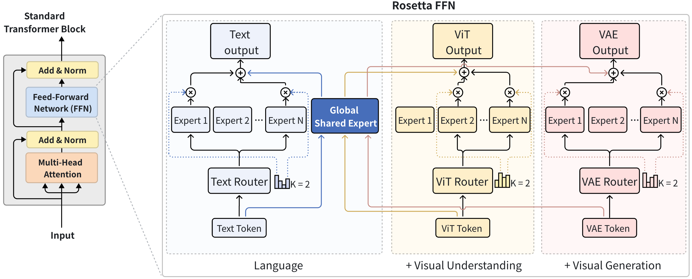
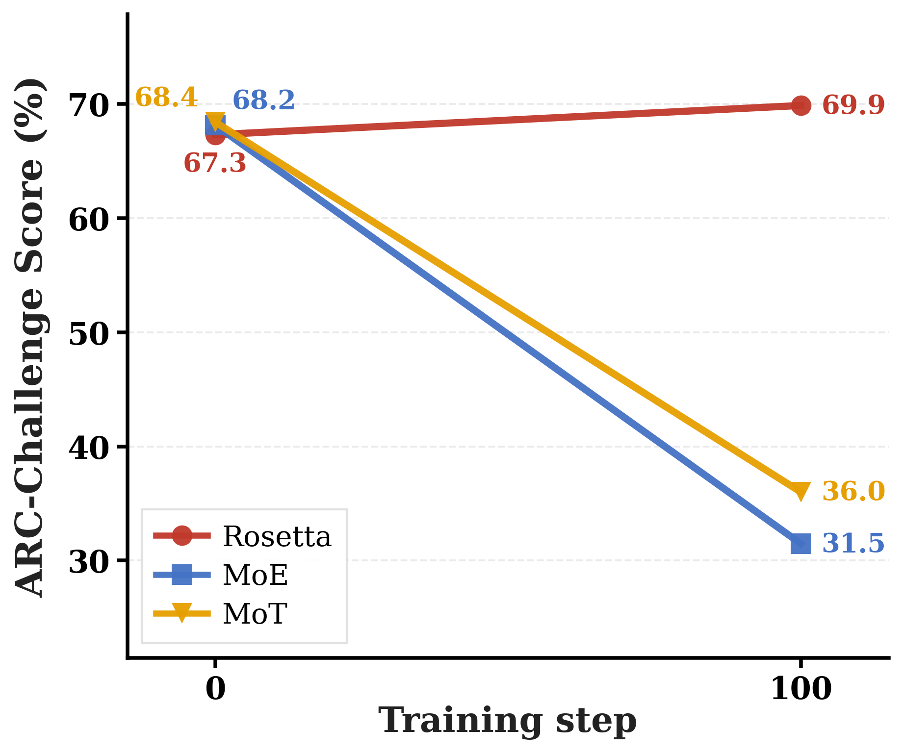
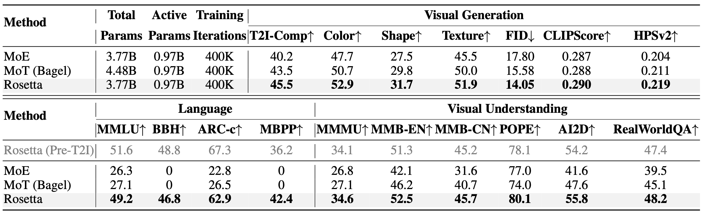

<div align="center">

# 🪨 Rosetta: Composable Native Multimodal Pretraining

<p align="center">
  <a href="https://rosetta-lmm.github.io/">
    
  </a>
 &nbsp;
  <a href="https://arxiv.org/abs/XXXX.XXXXX">
    
  </a>
  &nbsp;
  <a href="https://huggingface.co/tencent/Rosetta-inference">
    
  </a>
  &nbsp;
  
  &nbsp;
  
</p>

<p align="center">
  <b>Escaping the Forgetting-Synergy Dilemma in Native Multimodal Pretraining</b>
</p>

<p align="center">
  <a href="https://xiangyueliu.github.io/">Xiangyue Liu</a><sup>1</sup>,
  <a href="https://scholar.google.com/citations?user=TZ0nnhgAAAAJ&hl=zh-CN">Zijian Zhang</a><sup>2</sup>,
  <a href="https://openreview.net/profile?id=~Miles_Yang2">Miles Yang</a><sup>2</sup>,
  <a href="https://scholar.google.com/citations?user=igtXP_kAAAAJ&hl=en">Zhao Zhong</a><sup>2</sup>,
  <a href="https://scholar.google.com/citations?user=FJwtMf0AAAAJ&hl=en">Liefeng Bo</a><sup>2</sup>,
  <a href="https://scholar.google.com/citations?user=XhyKVFMAAAAJ&hl=en">Ping Tan</a><sup>1*</sup>
</p>
<p align="center">
  <sup>1</sup>HKUST &nbsp;&nbsp; <sup>2</sup>Tencent Hunyuan
</p>

</div>

<p align="center">
  
</p>

> **Figure 1.** *(Left)* Performance on MMLU (language ability) across composable pretraining stages (LM → +MMU → +T2I). Standard MoE and structurally-isolated MoT suffer catastrophic routing collapse upon integrating continuous generative objectives. **Rosetta maintains a stable semantic anchor throughout all stages.** *(Right)* Qualitative image generation results from the Rosetta model.

---

## 🏗️ Architecture

<p align="center">
  
</p>

> **Figure 2. Rosetta FFN.** Three mechanisms enable non-destructive modality expansion: **(1) Unified Attention** — globally shared QKV projections preserve dense cross-modal interactions. **(2) Composable FFN** — modality-specific plug-and-play experts (Text / ViT / VAE) are bridged by a single Global Shared Expert that anchors foundational knowledge. **(3) Conflict-Free Optimization (MAOP)** — surgically neutralizes destructive gradients with zero memory overhead.

---

## 🚀 Quick Start

### 1. Environment Setup

**Requirements:** Python 3.12+, CUDA 12.8+

```bash
git clone https://github.com/Lxiangyue/Rosetta.git
cd Rosetta

conda create -n rosetta python=3.12 -y
conda activate rosetta

# 1. Install PyTorch using your CUDA version
pip install torch==2.7.1 torchvision==0.22.1 torchaudio==2.7.1 --index-url https://download.pytorch.org/whl/cu128

# 2. Install dependencies
pip install -r requirements.txt

# 3. Install Flash Attention (required; takes ~20 mins to compile)
FLASH_ATTENTION_FORCE_BUILD=TRUE MAX_JOBS=8 pip install flash-attn==2.8.1 --no-build-isolation --no-binary flash-attn --no-cache-dir

```

### 2. Download Assets

Before running training or evaluation, please set up the shared assets, checkpoints, and datasets.

#### 🛠️ Shared Assets
```bash
# Required for both training and evaluation (includes VAE, ViT, tokenizer, and evaluation datasets; total 18G)
hf download tencent/Rosetta-inference public_assets.zip --local-dir . && unzip -o public_assets.zip && rm public_assets.zip
```

#### 📦 Model Checkpoints
```bash
# For Evaluation (Rosetta Main Model; total 17G)
hf download tencent/Rosetta-inference --include "checkpoints/Rosetta-3.8B-A1B/**" --local-dir .

# For Training (Stage 2/3 Init Checkpoints; total 17+17+20G)
hf download tencent/Rosetta-inference --include "checkpoints/Rosetta-3.8B-A1B-stage2-lm-mmu/**" --local-dir .
hf download tencent/Rosetta-inference --include "checkpoints/MoE-3.8B-A1B-stage2-lm-mmu/**" --local-dir .
hf download tencent/Rosetta-inference --include "checkpoints/MoT-4.5B-A1B-stage3-init/**" --local-dir .
```

#### 🗂️ Example Training Data
```bash
# Prepares open-source training data (LM data from LLaVA, MMU+T2I data from BAGEL; total 379M)
bash scripts/download_example_data.sh
```

<details>
<summary><b>Expected directory layout</b></summary>

```
Rosetta/
├── checkpoints/
│   ├── Rosetta-3.8B-A1B/                   ← For evaluation
│   │   └── hf_weights/                     ← safetensors model weights
│   ├── Rosetta-3.8B-A1B-stage2-lm-mmu/     ← For training
│   ├── MoE-3.8B-A1B-stage2-lm-mmu/         ← For training
│   └── MoT-4.5B-A1B-stage3-init/           ← For training
└── example_data/
│   ├── lm/
│   │   └── conversation_58k.json
│   ├── mmu/
│   │   └── images/
│   │   └── llava_ov_si.jsonl
│   ├── t2i/
│   │   └── *.parquet
└── public_assets/
    ├── image_encoder/          ← VAE (FLUX.2-VAE)
    ├── vision_encoder/         ← ViT (Qwen3-VL-30B-A3B-Instruct)
    ├── pretrained_llm/         ← tokenizer + Qwen3-0.6B-Base
    ├── generation_configs/     ← generation settings for evaluation
    └── evaluation/             ← benchmark datasets
        ├── ARC_C/
        ├── MMLU/
        ├── BBH/
        ├── MBPP/
        ├── MMMU/
        ├── MMBench/
        ├── POPE/
        ├── AI2D/
        ├── RealWorldQA/
        └── T2I-CompBench/
        └── dataset/
            └── COCO/
```
</details>

---

## 🔥 Training

⏳ **Time to Reproduce:** ~90 mins on 8x H20 GPUs (VRAM > 40GB).

We provide a minimal one-command demo to reproduce the **catastrophic forgetting** phenomenon and validate Rosetta's structural immunity. By injecting the Text-to-Image (T2I) generation task for just 100 steps of training, you can directly compare **Rosetta** against **MoE** and **MoT**:
```bash
bash scripts/run/run_example_train.sh
```

This script automatically evaluates the ARC-Challenge score (Language Ability) at step 0 and 100, generating the following comparison in `outputs/example_train/arc_step0_step100.png`:

<p align="center">
  
</p>

> **Key insight:** While MoE and MoT show a **significant performance drop** in language ability when learning visual generation, Rosetta **robustly averts this forgetting**.

<details>

<summary><b>🚀 Multinode Training</b></summary>
<p><br>⏳ Time to Reproduce: ~30 mins on 64x H20</p>

1. Create `hosts.txt` and replace entries with your own node hostnames/IPs. The first listed node will coordinate the distributed launch:
```text
node-0-ip
node-1-ip
node-2-ip
node-3-ip
node-4-ip
node-5-ip
node-6-ip
node-7-ip
```

2. Run multinode training:
```bash
hostfile=hosts.txt HOST_NUM=8 HOST_GPU_NUM=8 \
bash launch/run_multinode.sh scripts/run/run_example_train.sh --gradient-accumulation-steps 1
```

> **Note:** We set `--gradient-accumulation-steps 1` to keep the global batch size (gbs) consistent with the single-node 8 GPUs setting.

</details>

<details>
<summary><b>💻 Single-GPU Training</b></summary>
<br>

> **Note:** We provide two options for single-GPU users: the Equivalent Training (acc=64) to match the 8-GPU global batch size for exact score comparison (significantly slower), and the Fast Training (acc=8) for rapid experimentation (scores not directly comparable).

1. Equivalent Training (~9 hours on 1x H20)
```bash
HOST_GPU_NUM=1 bash scripts/run/run_example_train.sh --gradient-accumulation-steps 64
```

2. Fast Training (~90 mins on 1x H20)
```bash
HOST_GPU_NUM=1 bash scripts/run/run_example_train.sh --gradient-accumulation-steps 8
```

</details>

For complete training recipes, hyperparameters, data mix methods, please refer to [TRAIN.md](TRAIN.md).

---

## 📊 Evaluation

Run a quick evaluation (e.g., ARC-Challenge on Rosetta-3.8B-A1B; ~2 mins using 8 GPUS):
```bash
bash scripts/eval/eval_arc_c.sh
```

We provide scripts for evaluating 11 benchmarks covering LM, VLM, and T2I tasks, please see [EVAL.md](EVAL.md).

### Benchmarks
<p align="center">
  
</p>

---

## ✍️ Citation (Coming Soon)
```bibtex
@article{liu2026rosetta,
  title   = {Rosetta: Composable Native Multimodal Pretraining},
  author  = {Liu, Xiangyue and Zhang, Zijian and Yang, Miles and Zhong, Zhao and Bo, Liefeng and Tan, Ping},
  journal = {TODO},
  year    = {2026},
  url     = {https://arxiv.org/abs/XXXX.XXXXX}
}
```

<div align="center">
⭐ If Rosetta is useful to you, please consider starring the repo!
</div>
